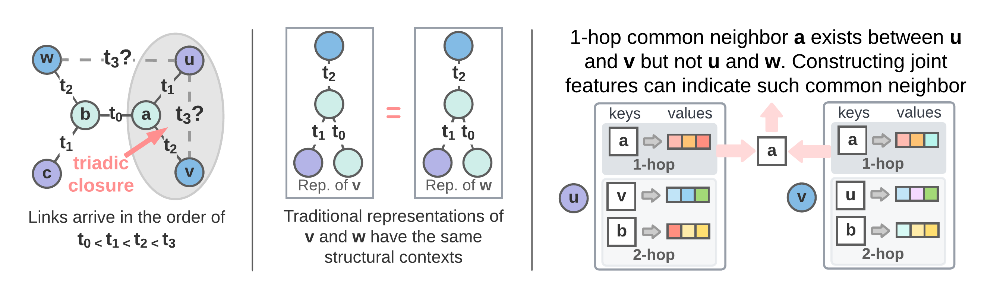
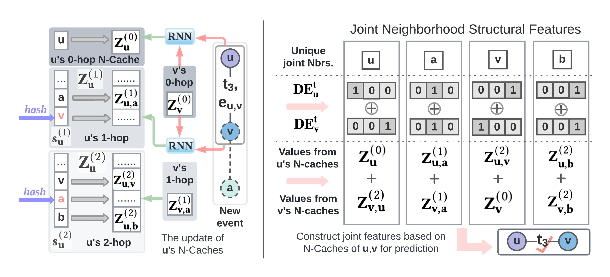

<h1 align="center">Neighborhood-Aware-Temporal-Network (NAT)</h1>
<p align="center">
    <a href="https://arxiv.org/abs/2209.01084"></a>
    <a href="https://github.com/Graph-COM/Neighborhood-Aware-Temporal-Network"></a>
    <!---<a href="https://proceedings.mlr.press/v162/miao22a.html">  </a>---!>
</p>

This repository contains the official implementation of NAT as described in the paper: [Neighborhood-aware Scalable Temporal Network
Representation Learning](https://arxiv.org/abs/2209.01084)(LoG 2022) by Yuhong Luo, and Pan Li.

## Introduction
In a temporal network, the joint neighborhood of a set of nodes often provides crucial structural information on predicting whether they may interact at a certain time. However, all previous works either fail to capture such information or depend on extremely time-consuming feature construction approaches.  Most temporal networks learn a vector representation for each node, and predict whether two node may interact (aka. a link) based on a combination (e.g. the inner product) of the two vector representations. However, they fail the simple example in Fig. 1 Left because they learn the same representation for nodes in different parts of the graph. Some recent works provide theoretically powerful solutions by constructing joint neighborhood structural features. However, their methods are computationally expensive and do not scale to large temporal networks.

To address these issues, this work proposes Neighborhood-Aware Temporal network model (NAT). For each node in the network, NAT abandons the commonly-used one-single-vector-based representation while adopting a novel dictionary-type neighborhood representation. Such a dictionary representation records a down-sampled set of the neighboring nodes as keys, and allows fast construction of structural features for a joint neighborhood of multiple nodes. We also design dedicated data structure termed N-cache to support parallel access and update of those dictionary representations on GPUs. A high-level abstraction is provided in Fig. 1 Right and a more detail learning procudure is provided in Fig. 2.

<p align="center"></p>
<p align="center"><em>Figure 1.</em> The introduction of NAT. Left: the task is to predict that $u$ prefers to interact with $v$ more than <em>w</em> at timestamp $t_3$ following the principle of triadic closure in social network. Middle: Traditional methods fail this task because they learn the same representations for node $v$ and node $w$. Right: construct joint neighborhood features based on N-caches. Node $a$ appears as a key in the first hop N-caches of both $u$ and $v$. Joining these keys can provide structural features that encodes common-neighbor information for prediction. </p>

<p align="center"></p>
<p align="center"><em>Figure 2.</em> The architecture of NAT. Left: Neighborhood representations of a node and the update procedures of these representations within the N-caches. Right: The construction of joint structural features using the neighborhood representations. </p>

## Requirements
* `python >= 3.7`, `PyTorch >= 1.4`, please refer to their official websites for installation details.
* Other dependencies:
```{bash}
pandas==1.4.3
tqdm==4.41.1
numpy==1.23.1
scikit_learn==1.1.2
```
Refer to `environment.yml` for more details.

We have tested our code on `Python 3.9` with `PyTorch 1.9.0`, and `CUDA 10.1`. Please follow the following steps to create a virtual environment and install the required packages.

Clone the repository:
```
git clone https://github.com/Graph-COM/Neighborhood-Aware-Temporal-Network
cd Neighborhood-Aware-Temporal-Network
```

Create a virtual environment:
```
conda create --name nat python=3.9 -y
conda activate nat
```

Install dependencies:
```
conda install -y pytorch==1.9.0 torchvision==0.10.0 torchaudio==0.9.0 cudatoolkit=10.2 -c pytorch
pip install -U scikit-learn
conda install tqdm==4.41.1
```


## Training Commands

#### Examples:

* To train **NAT** with Wikipedia dataset in transductive training, using 32 1-hop N-cache, 16 2-hop N-cache, neighborhood representation of 4 dimensions , and with overriding probability alpha = 0.7:
```bash
python main.py -d wikipedia --pos_dim 16 --bs 100 --n_degree 32 16 --n_hop 2 --mode t --bias 1e-5 --seed 2 --verbosity 1 --drop_out 0.1 --attn_n_head 2 --ngh_dim 4 --self_dim 72 --replace_prob 0.7 --run 5
```
To train in inductive training, change `mode` from `t` to `i`. Here is an example of inductive training on Wiki-talk, using 16 1-hop neighbors with neighborhood representation size 4 and 72 dimensions of self representations.
```bash
python main.py -d wiki-talk-temporal --pos_dim 16 --bs 100 --n_degree 16 --n_hop 1 --mode i --bias 1e-5 --seed 2 --verbosity 1 --drop_out 0.1 --attn_n_head 1 --ngh_dim 4 --self_dim 72 --run 5
```

## Usage Summary
```
usage: Interface for Neighbourhood-aware Scalable Learning for Temporal Networks
       [-h]
       [-d {wikipedia,reddit,socialevolve,uci,enron,socialevolve_1month,socialevolve_2weeks,sx-askubuntu,sx-superuser,wiki-talk-temporal,mooc}]
       [-m {t,i}] [--n_degree [N_DEGREE [N_DEGREE ...]]] [--n_hop N_HOP]
       [--bias BIAS] [--pos_dim POS_DIM] [--self_dim SELF_DIM]
       [--ngh_dim NGH_DIM] [--linear_out] [--attn_n_head ATTN_N_HEAD]
       [--time_dim TIME_DIM] [--n_epoch N_EPOCH] [--bs BS] [--lr LR]
       [--drop_out DROP_OUT] [--replace_prob REPLACE_PROB]
       [--tolerance TOLERANCE] [--seed SEED] [--verbosity VERBOSITY]
       [--run RUN]
```

### optional arguments:
```
  -h, --help            show this help message and exit
  -d {wikipedia,reddit,socialevolve,uci,enron,socialevolve_1month,socialevolve_2weeks,sx-askubuntu,sx-superuser,wiki-talk-temporal,mooc}, --data {wikipedia,reddit,socialevolve,uci,enron,socialevolve_1month,socialevolve_2weeks,sx-askubuntu,sx-superuser,wiki-talk-temporal,mooc}
                        data sources to use, try wikipedia or reddit
  -m {t,i}, --mode {t,i}
                        transductive (t) or inductive (i)
  --n_degree [N_DEGREE [N_DEGREE ...]]
                        a list of neighbor sampling numbers for different
                        hops, when only a single element is input n_layer will
                        be activated
  --n_hop N_HOP         number of hops the N-cache is used
  --bias BIAS           the hyperparameter alpha controlling sampling
                        preference with time closeness, default to 0 which is
                        uniform sampling
  --pos_dim POS_DIM     dimension of the positional embedding
  --self_dim SELF_DIM   dimension of the self representation
  --ngh_dim NGH_DIM     dimension of the neighborhood representation
  --linear_out          whether to linearly project each node's
  --attn_n_head ATTN_N_HEAD
                        number of heads used in tree-shaped attention layer,
                        we only use the default here
  --time_dim TIME_DIM   dimension of the time embedding
  --n_epoch N_EPOCH     number of epochs
  --bs BS               batch_size
  --lr LR               learning rate
  --drop_out DROP_OUT   dropout probability for all dropout layers
  --replace_prob REPLACE_PROB
                        probability for storing new neighbors to N-cache
                        replacing old ones
  --tolerance TOLERANCE
                        toleratd margainal improvement for early stopper
  --seed SEED           random seed for all randomized algorithms
  --verbosity VERBOSITY
                        verbosity of the program output
  --run RUN             number of model runs
```

## Instructions on Acquiring Datasets
Preprocessed datasets: Reddit, Wikipedia, SocialEvolve, Enron, and UCI can be downloaded from [here](https://drive.google.com/drive/folders/1umS1m1YbOM10QOyVbGwtXrsiK3uTD7xQ?usp=sharing) to `processed/`. Then run the following:
```{bash}
cd processed/
unzip data.zip
```
You may check that each dataset corresponds to three files: one `.csv` containing timestamped links, and two ``.npy`` as node & link features. Note that some datasets do not have node & link features, in which case the `.npy` files will be all zeros.

Raw data for Ubuntu can be downloaded using this [link](https://snap.stanford.edu/data/sx-askubuntu.txt.gz) and Wiki-talk using this [link](https://snap.stanford.edu/data/wiki-talk-temporal.txt.gz) to `processed`. Run the following to preprocess the data.
```{bash}
python process.py --dataset sx-askubuntu
python process.py --dataset wiki-talk-temporal
```

#### Use your own data
Put your data under `processed` folder. The required input data includes `ml_${DATA_NAME}.csv`, `ml_${DATA_NAME}.npy` and `ml_${DATA_NAME}_node.npy`. They store the edge linkages, edge features and node features respectively.

The `.csv` file has following columns
```
u, i, ts, label, idx
```
, which represents source node index, target node index, time stamp, edge label and the edge index.

`ml_${DATA_NAME}.npy` has shape of [#temporal edges + 1, edge features dimention]. Similarly, `ml_${DATA_NAME}_node.npy` has shape of [#nodes + 1, node features dimension].


All node index starts from `1`. The zero index is reserved for `null` during padding operations. So the maximum of node index equals to the total number of nodes. Similarly, maxinum of edge index equals to the total number of temporal edges. The padding embeddings or the null embeddings is a vector of zeros.

## Acknowledgement
Our implementation adapts the code [here](https://github.com/snap-stanford/CAW) as the code base and extensively adapts it to our purpose. We also adapts an efficient implementation of GAT [here](https://github.com/gordicaleksa/pytorch-GAT)  for the output attention layer. We thank the authors for sharing their code.
## Reference

If you find our paper and repo useful, please cite our paper:
```bibtex
@article{luo2022neighborhood,
  title       = {Neighborhood-aware Scalable Temporal Network Representation Learning},
  author      = {Luo, Yuhong and Li, Pan},
  journal     = {Learning on Graphs Conference},
  year        = {2022}
}
```
